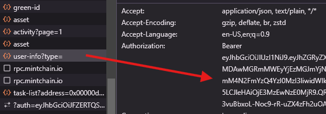

# Mint Chain Auto Daily and Spin

This script interacts with the MintChain API to automate certain tasks, including collecting user info, performing spins, injecting energy, and sending transactions on the blockchain.

## Features

- Auto Daily sign in.
- Auto Spins the turntable up to 10 times daily.
- Auto Injects energy to the Green Id.

## Prerequisites

1. **Python** 3.x
2. **Requirements** listed in `requirements.txt` (install instructions below)

## Required Files

1. Edit **`token.json`**: with your private keys and access tokens:
    ```json
    {
        "private_keys_tokens": [
            {
                "private_key": "your_private_key_1",
                "access_token": "your_access_token_1"
            },
            {
                "private_key": "your_private_key_2",
                "access_token": "your_access_token_2"
            }
        ]
    }
    ```

## How to get access token
- First login to [Mintchain Dashboard](https://www.mintchain.io/mint-forest?inviteCode=4AAAD2AE)
- Press F12 to open console
- find and click Network 
- Last find user-info and copy your `Authorization`, copy from `eyjhb......`

## Installation

1. Clone this repository:
    ```bash
    git clone https://github.com/Zlcyber/mintchain.git
    ```
2. Navigate to the project directory:
    ```bash
    cd mintchain
    ```
3. Install the required packages:
    ```bash
    pip install -r requirements.txt
    ```
4. Run the script:
    ```bash
    python3 main.py
    ```


